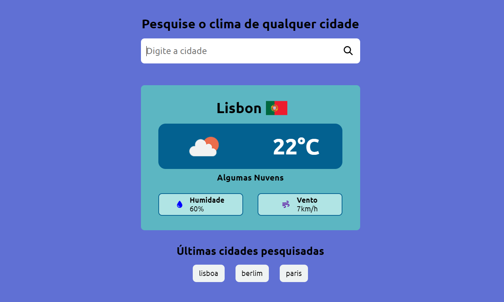

# Clima-Tempo

Link da página: <https://clima-tempo-eta-two.vercel.app/>

## Sobre

Este projeto é uma aplicação para fazer a busca das informações climáticas de qualquer cidade informada pelo usuário. O usuário ao informar a cidade e clicar em buscar irá obter as informações sobre o clima da cidade, que também vai mostrar a bandeira do país logo ao lado do nome da cidade pesquisada. A aplicação também armazena todas as cidades pesquisadas em uma array e mostrará apenas as últimas 3 cidades pesquisadas logo abaixo do campo de pesquisa ou abaixo do componente com as informações do clima, onde o usuário poderá clicar e já obter as informações sobre o clima da cidade sem precisar digitar no input. Utilizei o local storage para salvar as cidades pesquisadas para que o usuário não perca as informações sempre que iniciar a plicação.

## Objetivos

Meu objetivo nesse projeto foi aperfeiçoar meus conhecimentos em React e requisições http, nele pude trabalhar pela primeira vez com uma chave para fazer arequisição de uma api e utilizei o .Env para guardar a chave de acesso. A aplicação está toda componentizada e responsiva, também pude trabalhra bastante a lógica de programção principalmente para manipular as últimas cidades pesquisadas no array e só mostrar as últimas 3 na tela.

## Competências utilizadas

* HTML
* CSS
* JAVASCRIPT
* REACT.JS
